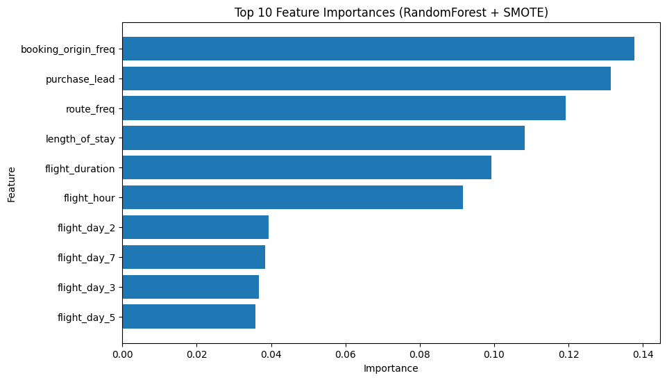

# ✈️ Customer Flight Booking Prediction

## 📌 Overview
This project uses historical airline booking data to **predict whether a customer will complete a flight booking**.  
The goal is to help airlines identify high-value customers and improve marketing strategies.

---

## 📊 Dataset
- **Rows:** 50,000 bookings
- **Features:**  
  - `num_passengers` – number of passengers traveling  
  - `sales_channel` – booking platform (Internet/Mobile)  
  - `trip_type` – type of trip (Round Trip, One Way, Circle Trip)  
  - `purchase_lead` – days between booking and travel  
  - `length_of_stay` – days spent at destination  
  - `flight_hour` – departure time (hour)  
  - `booking_origin` – country from where booking was made  
  - `wants_extra_baggage`, `wants_preferred_seat`, `wants_in_flight_meals` – customer preferences  
  - `flight_duration` – total flight time (hours)  
- **Target:** `booking_complete` (1 = completed booking, 0 = not completed)

---

## 🔍 Approach
1. **EDA (Exploratory Data Analysis)**  
   - Identified severe class imbalance (15% positive class)  
   - Explored categorical vs numerical feature relationships  
2. **Data Preprocessing**  
   - Converted `flight_day` to numeric mapping  
   - Encoded categorical variables  
   - Handled imbalance with **SMOTE**  
3. **Modeling**  
   - Random Forest Classifier (chosen for interpretability)  
4. **Evaluation**  
   - 5-fold cross-validation with **F1-score** as the metric  

---

## 🚀 Results
| Model Version | Avg F1-score |
|--------------|--------------|
| Without balancing | **0.12** |
| With SMOTE | **0.73** |

**Top Predictors:**
- `purchase_lead`
- `flight_hour`
- `length_of_stay`
- `sales_channel`
- `trip_type`

---

## 📈 Visuals
Feature Importance Plot:  

---

## 🛠️ Tech Stack
- **Python**
- Pandas, NumPy
- Scikit-learn
- Matplotlib, Seaborn
- Imbalanced-learn (SMOTE)

---

## 📂 Project Structure
